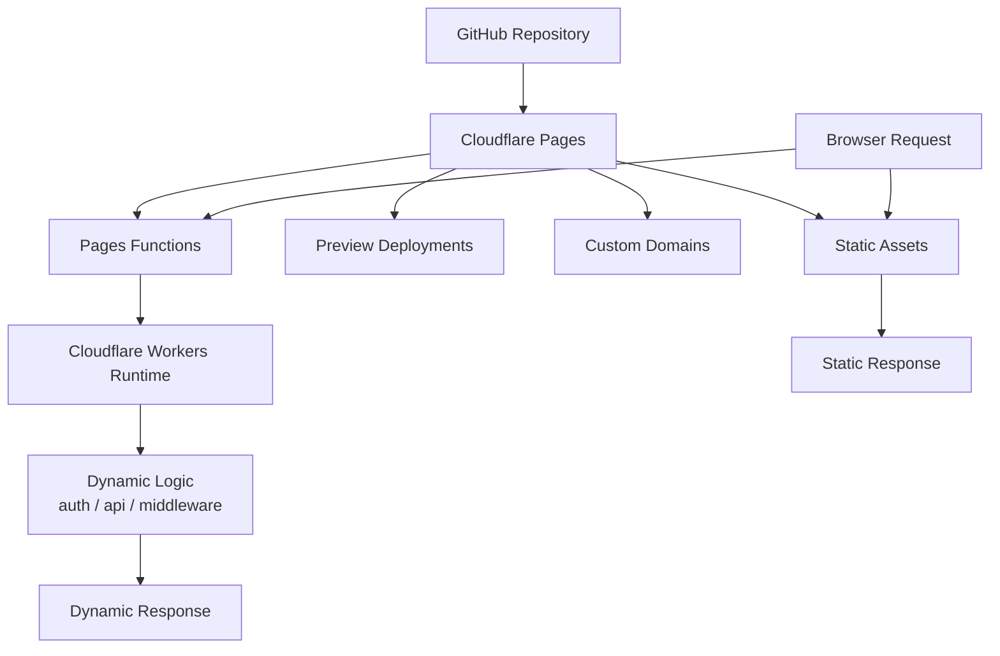
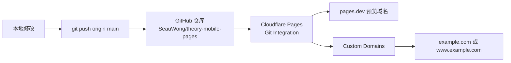

# Cloudflare Pages / Workers 速记

基于 Cloudflare 官方文档整理，核对日期：`2026-04-11`。

## 1. Workers 和 Pages 的关系

- `Workers` 是 Cloudflare 的边缘计算平台。
- `Pages` 是更偏前端部署的产品，主要负责静态站点托管、Git 自动部署、预览环境和自定义域名。
- `Pages Functions` 底层跑在 `Workers` 上，Cloudflare 官方明确写明：
  - `Pages Functions allows you to build full-stack applications ... with Cloudflare Workers`
  - `Requests to your Functions are billed as Cloudflare Workers requests`

对当前这个项目的直接结论：

- 如果只是部署静态页面，优先用 `Pages`
- 如果在 Pages 项目里增加动态接口、鉴权、中间件等，再用 `Pages Functions`
- 如果要做更通用的边缘程序，不依赖 Pages 的前端部署能力，再直接用 `Workers`

## 2. Git 自动部署怎么工作

Cloudflare 官方 Git 集成流程：

1. 到 `Workers & Pages`
2. `Create application`
3. 选择 `Pages`
4. 选择 `Connect to Git`
5. 连接 GitHub 或 GitLab
6. 选择仓库
7. 配置分支和构建参数

对本仓库 `SeauWong/theory-mobile-pages` 的推荐配置：

- `Production branch`: `main`
- `Build command`: 留空
- `Build output directory`: `/`

原因：

- 当前项目是纯静态站点
- 不需要构建步骤
- 每次往 `main` 推送后，Cloudflare Pages 会自动构建并部署

## 3. 自定义域名的边界

Pages 的 `Custom domains` 绑定的是域名或子域名，不是 URL 路径。

可以绑定：

- `example.com`
- `www.example.com`
- `page2.example.com`

不可以直接绑定：

- `example.com/page2`

Cloudflare 官方自定义域名步骤：

1. 进入 `Workers & Pages`
2. 选择你的 Pages 项目
3. 进入 `Custom domains`
4. 点击 `Set up a domain`
5. 输入域名并继续

额外限制：

- 如果你绑定的是根域 `example.com`，该域名必须是同一 Cloudflare 账号下的 zone
- 如果你绑定的是子域名，通常通过 CNAME 即可接入
- 不要先手动添加指向 `*.pages.dev` 的 CNAME，再回 Pages 里绑定；官方明确提示这样可能导致 `522`

## 4. 当前 Free 计划下最重要的 Pages 限额

根据 Cloudflare Pages 官方 limits 文档，Free 计划下：

- 每月最多 `500` 次构建
- 每个项目最多 `100` 个自定义域名
- 每个站点最多 `20,000` 个文件
- 单个静态文件最大 `25 MiB`
- 同一个项目可同时拥有 `无限` 个 preview deployments
- 一个账号下 `Pages` 项目数有 `100` 个软限制

对纯静态站点，最常先碰到的限制通常不是访问量，而是 `500 builds/月`。

## 5. Pages Functions 对应的 Workers 免费额度

如果你的 Pages 项目启用了 `Functions`，它们按 Workers 计费。

Workers Free 计划当前包含：

- `100,000 requests / day`
- 每次调用 `10 ms CPU time per invocation`
- 静态资源请求 `free and unlimited`

所以：

- 纯静态 Pages 项目，核心是看 Pages 的构建和文件限制
- 只有触发 `Functions` 的请求，才会进入 Workers 的免费配额统计

## 6. 对当前项目的直接建议

- 现在这个专题页是纯静态页面，直接用 `Pages + Git integration`
- 先绑定 `example.com` 和 `www.example.com` 中你想要的主域名
- 如果以后需要第二个专题：
  - 用路径：`example.com/page2`
  - 或用子域：`page2.example.com`
- 不要把 `example.com/page2` 当成“自定义域名绑定项”

## 图 1：Workers / Pages / Functions 关系图

## 图 2：当前项目推荐部署路径

## 官方文档

- Pages Functions: https://developers.cloudflare.com/pages/functions/
- Pages Functions Pricing: https://developers.cloudflare.com/pages/functions/pricing/
- Workers Pricing: https://developers.cloudflare.com/workers/platform/pricing/
- Pages Limits: https://developers.cloudflare.com/pages/platform/limits/
- Git integration: https://developers.cloudflare.com/pages/get-started/git-integration/
- Custom domains: https://developers.cloudflare.com/pages/configuration/custom-domains/
